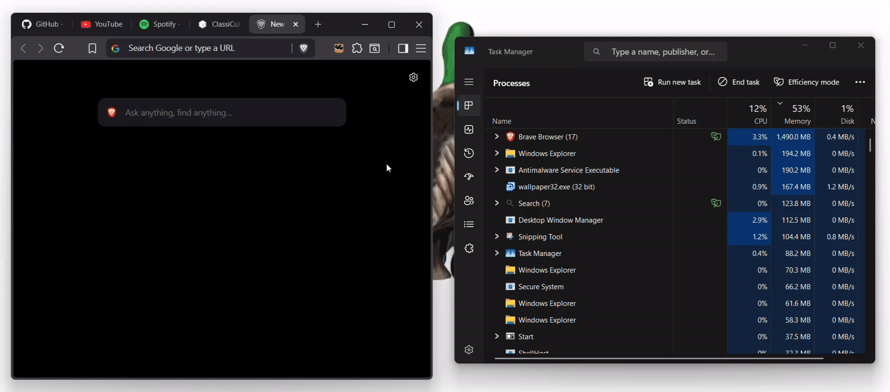

# tabby 

 a lightweight browser extension that suspends all background tabs with one click

## features

* quick tab suspension
* automatically suspend tabs on startup
* reduce memory usage
* lightweight 

## usage

open the tabby extension then click the cookie to suspend all background tabs

## installation

1. download and extract the 

2. go to the manage extensions page of you browser and click 'load unpacked' (developer mode must be enabled)

3. select the extracted folder